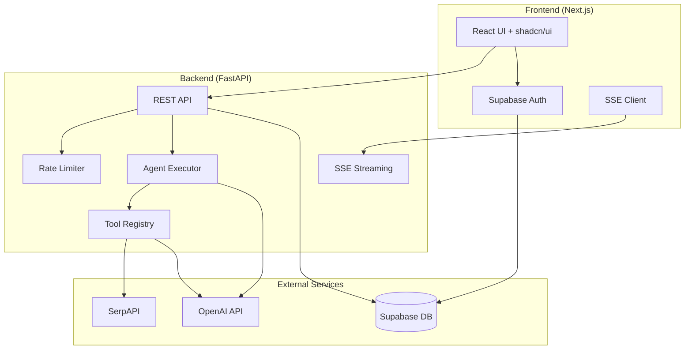

# AgentForge

**AI workflow agent platform — build, configure, and run multi-step AI agents with tool use.**

Build custom AI agents that chain LLM calls, search the web, parse documents, extract structured data, execute code, and automate repetitive tasks — all through a clean web interface.


---

## Features

### Agent Builder
Create custom agents with a name, system prompt, tool selection, and multi-step workflow definitions. Agents can chain together multiple LLM calls with accumulated context.

### Agent Runner
Execute agents with text input or file uploads. Real-time SSE streaming shows step-by-step execution with output appearing as it's generated.

### Pre-built Templates

| Agent | Description | Tools Used |
|-------|-------------|------------|
| **Document Analyzer** | Upload a PDF/DOCX → structured summary, entities, action items | document_reader, data_extractor, summarizer |
| **Research Agent** | Topic → web search, synthesis, structured report | web_search, summarizer |
| **Data Extractor** | Unstructured text → clean JSON with entities and relationships | data_extractor |
| **Code Reviewer** | Code → bug, security, and performance review with severity ratings | code_executor |

### Dashboard
- Agent management with run counts
- Run history with expandable execution logs
- Token usage tracking with cost estimates
- Rate limit status (10 runs/hour free tier)
- API key generation for programmatic access

### Tools Library

| Tool | Description |
|------|-------------|
| `web_search` | Search the web via SerpAPI |
| `document_reader` | Extract text from PDF/DOCX files |
| `code_executor` | Run Python in a sandboxed environment |
| `data_extractor` | Extract structured JSON from text |
| `summarizer` | Condense long documents |

---

## Architecture



---

## Tech Stack

| Layer | Technology |
|-------|-----------|
| Frontend | Next.js 14, TypeScript, Tailwind CSS, shadcn/ui |
| Backend | Python 3.12, FastAPI, LangChain, OpenAI API |
| Database | PostgreSQL via Supabase |
| Auth | Supabase Auth (email + GitHub OAuth) |
| Deployment | Vercel (frontend) + Render (backend) |
| CI/CD | GitHub Actions |

---

## Setup

### Prerequisites

- Node.js 20+
- Python 3.12+
- Supabase project ([create one](https://supabase.com))
- OpenAI API key

### 1. Clone the repository

```bash
git clone https://github.com/AaronCx/AgentForge.git
cd AgentForge
```

### 2. Set up the database

Run the SQL migrations in your Supabase dashboard (SQL Editor), in order:

```
supabase/migrations/001_users.sql
supabase/migrations/002_agents.sql
supabase/migrations/003_runs.sql
supabase/migrations/004_api_keys.sql
```

### 3. Set up the backend

```bash
cd backend
python -m venv .venv
source .venv/bin/activate
pip install -r requirements.txt

cp .env.example .env
# Edit .env with your keys
```

```bash
uvicorn app.main:app --reload
```

### 4. Set up the frontend

```bash
cd frontend
npm install

cp .env.example .env.local
# Edit .env.local with your Supabase keys
```

```bash
npm run dev
```

### 5. Using Docker

```bash
cp backend/.env.example .env
# Edit .env with all required keys

docker-compose up --build
```

---

## Environment Variables

### Backend (`backend/.env`)

| Variable | Description |
|----------|-------------|
| `OPENAI_API_KEY` | OpenAI API key for gpt-4o-mini |
| `SUPABASE_URL` | Supabase project URL |
| `SUPABASE_SERVICE_KEY` | Supabase service role key |
| `SERPAPI_KEY` | SerpAPI key for web search tool |
| `FRONTEND_URL` | Frontend URL for CORS |

### Frontend (`frontend/.env.local`)

| Variable | Description |
|----------|-------------|
| `NEXT_PUBLIC_SUPABASE_URL` | Supabase project URL |
| `NEXT_PUBLIC_SUPABASE_ANON_KEY` | Supabase anonymous key |
| `NEXT_PUBLIC_API_URL` | Backend API URL |

---

## API Documentation

### Authentication

All API endpoints require a Bearer token from Supabase Auth:

```
Authorization: Bearer <supabase-access-token>
```

Or use an API key generated from the Settings page:

```
Authorization: Bearer <af_...>
```

### Endpoints

#### Agents

| Method | Path | Description |
|--------|------|-------------|
| `GET` | `/api/agents` | List your agents |
| `GET` | `/api/agents/templates` | List pre-built templates |
| `GET` | `/api/agents/:id` | Get agent details |
| `POST` | `/api/agents` | Create an agent |
| `PUT` | `/api/agents/:id` | Update an agent |
| `DELETE` | `/api/agents/:id` | Delete an agent |

#### Runs

| Method | Path | Description |
|--------|------|-------------|
| `GET` | `/api/runs` | List your runs |
| `GET` | `/api/runs/:id` | Get run details |
| `POST` | `/api/agents/:id/run` | Execute an agent (SSE stream) |

#### API Keys

| Method | Path | Description |
|--------|------|-------------|
| `GET` | `/api/keys` | List your API keys |
| `POST` | `/api/keys` | Generate a new key |
| `DELETE` | `/api/keys/:id` | Revoke a key |

#### Stats

| Method | Path | Description |
|--------|------|-------------|
| `GET` | `/api/stats` | Get usage statistics |

### Example: Create and Run an Agent

```bash
# Create an agent
curl -X POST http://localhost:8000/api/agents \
  -H "Authorization: Bearer $TOKEN" \
  -H "Content-Type: application/json" \
  -d '{
    "name": "My Summarizer",
    "system_prompt": "Summarize the following text concisely.",
    "tools": ["summarizer"],
    "workflow_steps": ["Read the input", "Generate a concise summary"]
  }'

# Run the agent (SSE stream)
curl -N "http://localhost:8000/api/agents/<agent-id>/run?token=$TOKEN&input_text=Your+text+here" \
  -X POST
```

---

## Running Tests

```bash
cd backend
pip install pytest pytest-asyncio
pytest tests/ -v
```

---

## Project Structure

```
agentforge/
├── frontend/          # Next.js 14 + TypeScript + Tailwind + shadcn/ui
│   ├── app/           # App Router pages (auth, dashboard, agents, runs, settings)
│   ├── components/    # UI components (agents, runner, dashboard)
│   └── lib/           # Supabase client, API client, utilities
├── backend/           # FastAPI + LangChain + OpenAI
│   ├── app/
│   │   ├── routers/   # API endpoints (agents, runs, auth, api_keys)
│   │   ├── services/  # Agent executor, tools, rate limiter, templates
│   │   └── models/    # Pydantic models
│   └── tests/         # Unit tests
├── supabase/          # Database migrations
├── .github/workflows/ # CI/CD pipelines
└── docker-compose.yml # Docker orchestration
```

---

## License

MIT
